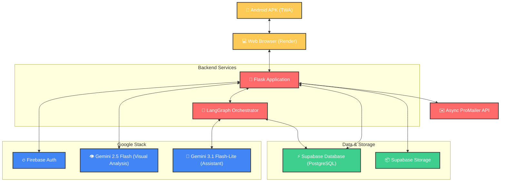

# 🔗 LostLinks

[](https://render.com)
[](https://firebase.google.com/)
[](https://ai.google.dev/)
[](https://github.com/langchain-ai/langgraph)
[](https://maps.google.com)
[](https://mail.google.com)
[](https://supabase.com)
[](https://developer.android.com/)

**LostLinks** is a smart, AI-powered lost and found portal designed for campus communities (specifically tailored for **IIT Bhilai**). It bridges the gap between losing an item and recovering it by utilizing cutting-edge vision models and conversational AI agents. **LostLinks** is a modern, responsive web application designed to help campus communities easily report and track lost and found items. By integrating an intuitive Bento Box interface with advanced mapping and an AI-powered assistant, LostLinks simplifies the recovery process for everyone.

Available as a web application hosted on **Render** and a native-like **Android APK** using Trusted Web Activities (TWA).

---
## 🌟 Key Features

*   **👁️ AI-Powered Visual Cataloging (Gemini 2.5 Flash)**: Upload or snap a photo of a found item, and the system automatically analyzes the image to generate a precise title, select the appropriate category, and draft a rich, marker-focused description.
*   **💬 LostLinks Conversational Assistant (Gemini 3.1 Flash-Lite + LangGraph)**: A persistent AI companion that helps users search for items, filter by proximity to campus landmarks, check their own reports, and even file lost/found reports directly through natural language.
*   **📍 Landmark Proximity Search**: Integrated with campus-specific coordinate mappings (hostels, academic blocks, grounds) allowing the AI assistant to calculate and return items lost or found near specific landmarks.
*   **🔒 Secure Campus Authentication**: Restricted to authorized `@iitbhilai.ac.in` email addresses using **Firebase Authentication**, featuring email verification and password recovery.
*   **✉️ Instant Email Notifications**: Automatically dispatches rich HTML emails to reporters and claimants when claims are made, items are resolved, or new messages are sent in the chat room.
*   **💬 Integrated Chat Rooms**: Dedicated real-time communication channels for every reported item, enabling safe and direct coordination between the owner and finder.
*   **🚀 Dashboard & Profile Management:** Track your active and resolved listings, update statuses, and manage claimant resolution directly from a personalized dashboard.
*   **🎨 Neumorphic & Modern Design:** A beautifully styled, responsive UI built with Tailwind CSS, supporting modern design tokens and micro-animations.
---

## 🛠️ Tech Stack

### Backend
- **Framework:** Flask (Python)
- **Database/Auth:** Supabase, Pyrebase4 (Firebase)
- **Emailing:** Promailer API with SMTP Gmail Connection
- **AI Integration:** LangChain, LangGraph, Pydantic Google Generative AI (Gemini)

### Frontend
- **Templating:** HTML5 / Jinja2
- **Styling:** Tailwind CSS (compiled locally)
- **Mapping:** Leaflet.js
- **Interactivity:** Vanilla JavaScript

## Google Tools/Software used
- **Firebase** for Authentication 
- **GMail** for User2User Communications
- **Gemini AI Studio API** for AI Powers
- **Google Maps** for location Services

## 📐 System Architecture



---

## 🚀 Deployment

### 🌐 Web Hosting (Render)
The web application is fully containerized and deployed on **Render**.
*   **Web URL**: `https://<your-render-subdomain>.onrender.com`
*   **Gunicorn WSGI Server**: Utilized for handling concurrent production traffic.
*   **Automatic SSL/TLS**: Provided out-of-the-box by Render.
*   [](https://lostlinks.onrender.com)

### 📱 Android APK
The mobile client is built as a **Trusted Web Activity (TWA)**.
*   **Digital Asset Links Verification**: Configured in [assetlinks.json](file:///.well-known/assetlinks.json) containing the SHA-256 fingerprint of the APK's signing key.
*   **Native Features**: Integrates with the device's camera to allow users to snap pictures of found items directly from the app.

### 🚀 Getting Started Locally

Follow these instructions to get a copy of the project up and running on your local machine for development and testing purposes.

### Prerequisites

- Python 3.8+
- Node.js and npm (for Tailwind CSS)
- API Keys for Google Gemini, Supabase, Promailer and Firebase (configured in `.env`)
- Also setting up Google Account for App and its App Password (to run EMAIL SERVICE)

### Installation & Setup

1. **Clone the repository:**
   ```bash
   git clone https://github.com/SumiRann1/LostLinks.git
   cd LostLinks
   ```

2. **Set up the Python Virtual Environment:**
   ```bash
   python -m venv .venv
   source .venv/bin/activate  # On Windows use: .venv\Scripts\activate
   ```

3. **Install Backend Dependencies:**
   ```bash
   pip install -r requirements.txt
   ```

4. Set Up Environment Variables
Create a `.env` file in the root directory and add the following:
   ```env
   # Flask
   SECRET_KEY=your_super_secret_key
   
   # Supabase
   SUPABASE_URL=your_supabase_url
   SUPABASE_KEY=your_supabase_anon_key
   
   # Firebase Configuration
   apiKey=your_firebase_api_key
   authDomain=your_firebase_auth_domain
   projectId=your_firebase_project_id
   storageBucket=your_firebase_storage_bucket
   messagingSenderId=your_firebase_messaging_sender_id
   appId=your_firebase_app_id
   measurementId=your_firebase_measurement_id
   databaseURL=your_firebase_database_url
   
   # Google Gemini API
   GEMINI_API_KEY=your_gemini_api_key
   
   # Email Notification API (ProMailer)
   PROMAILER_API_KEY=your_promailer_api_key
   PROMAILER_SMTP_ID=your_promailer_smtp_id
   MAIL_SENDER=your_configured_sender_email
   ```

5. **Install Frontend Dependencies:**
   ```bash
   npm install
   ```

### Running the Application

1. **Build Tailwind CSS (Optional/Development):**
   If you make changes to the CSS or HTML classes, compile Tailwind using:
   ```bash
   npx tailwindcss -i ./static/css/input.css -o ./static/css/style.css --watch
   ```

2. **Start the Flask Server:**
   ```bash
   python main.py
   ```

3. **Access the Application:**
   Open your browser and navigate to `http://localhost:5000`.

## 👥 Team & GDG Hackathon
Developed for the **GDG SolsticeHack Hackathon**.
*   **Goal**: Providing a smart, secure, and AI-driven utility for campus residents to recover lost belongings quickly.
*   **Focus**: Maximum leverage of Google's AI technologies (Gemini Vision and Language models) and Cloud services (Firebase).
